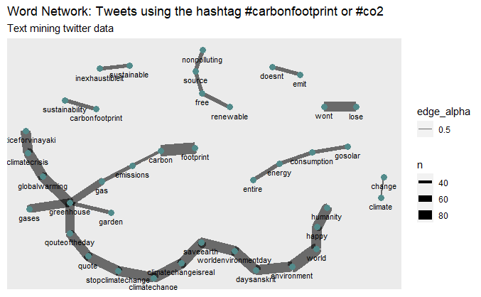
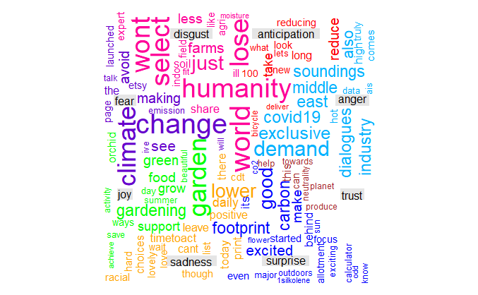

# Twitter Analysis for CO2mustGo initiative

```{r, echo=FALSE, error=FALSE, message=FALSE, warning=FALSE}
library(shinycssloaders)
library(reshape2)
library(ggplot2)
library(dplyr)
library(rvest)
library(plotly)
library(scales)
library(tidyverse)
library(wesanderson)    
library(shiny)
library(shinydashboard)
library(twitteR)
library(rtweet)
library(sentimentr)
library(tidyverse)
library(rvest)
library(purrr)
library(devtools)
library(textdata)
library(ggplot2)
library(ggthemes)
library(xml2)
library(qdap)
library(rvest)
library(wordcloud)
library(RColorBrewer)
library(NLP)
library(tm)
library(tidytext)
library(dplyr)
library(tidyr)
library(ggthemes)
library(plotly)
library(tidyverse)
library(broom)
library(remotes)
library(janeaustenr)
library(qdap)
library(glue)
library(syuzhet)
library(rtweet)
library(ggplot2)
library(igraph)
library(ggraph)
library(widyr)
library(syuzhet)
```

## What is CO2mustGO? {-}

```{r,echo=FALSE, fig.align='center', out.width="50%",fig.cap="Foto von Andrea Piacquadio von Pexels"}
knitr::include_graphics("Graphics/CO2.jpg")
```
<div style="text-align: justify"> 

At the beginning of 2020 I heared that my working colleagues from another institute at the WU have launched an initiative called CO2mustGO initiative. The initiative aims to gather multinational group of students, researchers and teachers from the Vienna University of Economics and Business and other universities around Europe, to unite around the single issue of carbon price. This project started as a university course, with the vision of uniting students and scientists in an international movement supporting every serious carbon price initiative globally. Since my hometown, Tuzla, [heavily suffers from the air pollution](http://unmaskmycity.org/project/tuzla/#:~:text=The%20Tuzla%20Thermal%20Power%20Plant%20is%20one%20of%20the%20ten,the%20largest%20source%20of%20PM2.), I felt that I should give my contribution to this initiative and joined them in April 2020. I decided to support it with my R programming skills. Consequently, I ended up analyzing Twitter data, as it is one of the hot-spots for this topic.

My role was to spark interest of stakeholders regarding this issue by using data available. Therefore, my tasks were related to using R to create understandable visualizations and to make use of Twitter data available.  

</div> 


```{r, echo=FALSE,fig.align='center',out.width="100%",warning=FALSE,error=FALSE, message=FALSE,fig.cap="Energy production capacities in the EU",eval=FALSE}
# Packages

library(networkD3)
library(tidyr)
library(tidyverse)
library(plotly)

# Major
table <- read.csv("data/capacity_data.csv", stringsAsFactors = T)
```

## Sankey diagram: Energy production capacity

```{r, echo=TRUE,fig.align='center',out.width="100%",warning=FALSE,error=FALSE, message=FALSE,eval=FALSE}
# Creation of source
table$typ_11 <- factor(table$typ_11,levels = c("c1","c2","g1","g2","g3","g4","n","o1","o2","o3","o4","r1","res"),labels = c("0","1","2","3","4","5","6","7","8","9","10","11","12"))
source1 <- as.vector.factor(table$typ_11)
source1 <- as.numeric(source1)

#Country as mediator
table2 <- table
table2$country<-as.character(table2$country)
table2$country[table$country=="AT"] <- 14
table2$country[table$country=="BE"] <- 15
table2$country[table$country=="BG"] <- 16
table2$country[table$country=="CH"] <- 17
table2$country[table$country=="CY"] <- 18
table2$country[table$country=="CZ"] <- 19
table2$country[table$country=="DE"] <- 20
table2$country[table$country=="DK"] <- 21
table2$country[table$country=="EE"] <- 22
table2$country[table$country=="ES"] <- 23
table2$country[table$country=="FI"] <- 24
table2$country[table$country=="FR"] <- 25
table2$country[table$country=="GR"] <- 26
table2$country[table$country=="HR"] <- 27
table2$country[table$country=="HU"] <- 28
table2$country[table$country=="IE"] <- 29
table2$country[table$country=="IT"] <- 30
table2$country[table$country=="LT"] <- 31
table2$country[table$country=="LU"] <- 32
table2$country[table$country=="LV"] <- 33
table2$country[table$country=="NL"] <- 34
table2$country[table$country=="NO"] <- 35
table2$country[table$country=="PL"] <- 36
table2$country[table$country=="PT"] <- 37
table2$country[table$country=="RO"] <- 38
table2$country[table$country=="SE"] <- 39
table2$country[table$country=="SI"] <- 40
table2$country[table$country=="SK"] <- 41
table2$country[table$country=="UK"] <- 42
target1<- table2$country

#Creation of mediator(country),source and value
value <- table2 %>% group_by(country,typ_11) %>%
  count(mw_2018)

#1st part of Target
target1 <- value$country
target1<-as.numeric(target1)

#1st part of Value
value1<-value$mw_2018

#Creation of the final target
value.df <-table2 %>% group_by(country)%>% summarise(sum(mw_2018))
value.df$country<-as.numeric(value.df$country)

#2nd part of Source(from countries to total capacity)
target1.2 <-value.df$country

#2nd part of Values (total of countries to the grand total)
value1.2<-value.df$`sum(mw_2018)`

#Final target

ft<-rep(13,29)
final_target <- c(target1,ft)

#final source
final_soruce <-c(source1,target1.2)

#final value
final_value <-c(value1,value1.2)

fig <- plot_ly(
  type = "sankey",
  orientation = "h",
  valuesuffix = "MW",
  arrangement = "snap",
  node = list(
    label = c(
      "Coal-lignite", # Node 0
      "Coal-hard", # Node 1
      "G1-gas", # Node 2
      "G2-gas", # Node 3
      "G3-gas", # Node 4
      "G4-gas", # Node 5
      "Nunclear",  # Node 6
      "O1-oil", # Node 7
      "O2-oil", # Node 8
      "O3-oil", # Node 9
      "O4-oil", # Node 10
      "Renewables",# Node 11
      "Hydro", # Node 12
      "Total capacity", # Node 13
      "AT",#Node 14
      "BE",#Node 15
      "BG",#Node 16
      "CH",#Node 17
      "CY",#Node 18
      "CZ",#Node 19
      "DE",#Node 20
      "DK",#Node 21
      "EE",#Node 22
      "ES",#Node 23
      "FI",#Node 24
      "FR",#Node 25
      "GR",#Node 26
      "HR",#Node 27
      "HU",#Node 28
      "IE",#Node 29
      "IT",#Node 30
      "LT",#Node 31
      "LU",#Node 32
      "LV",#Node 33
      "NL",#Node 34
      "NO",#Node 35
      "PL",#Node 36
      "PT",#Node 37
      "RO",#Node 38
      "SE",#Node 39
      "SI",#Node 40
      "SK",#Node 41
      "UK")),#Node 42
  link = list(
    source = final_soruce,
    target = final_target,
    value = final_value))

total.capacity <- fig %>% layout(title = "Energy Production Capacity in the EU")
total.capacity

```

```{r, echo=FALSE,fig.align='center',out.width="100%",warning=FALSE,error=FALSE, message=FALSE,fig.cap="Energy production capacities in the EU"}
library(widgetframe)
new <- readRDS("data/total.capacity.rds")
new
```
<div style="text-align: justify"> 

In order to depict the nature of energy production facilities across EU countries, I created this sankey diagram. On the left side, you can see types of energy sources across the EU countries (data is not updated). In the middle, you can see respective countries. Finally, on the right you see the total of energy production. Especially nice feature of the visualization is the interactive component, so that, for instance, using "Box select" option, you can merge certain number of components of the same type (e.g., select 3 sources of energy) and the visualization changes accordingly.

</div> 


## Twitter data analysis {-}

<div style="text-align: justify"> 

Twitter is nowadays among platforms that host strong communities. Carbon footprint and its repercussions belongs to prominent climate issue. Consequently, I decided to analyze Tweets downloaded via Twitter API on on 10.06.2020. The aim was simply to explore data about tweets with hashtags #carbonfootprint or #co2 and try to draw conclusions on how to approach social media presence on Twitter.

</div> 


### Data

Our data was stored in CSV format.`rtweet` package provides nice function to read in data conveniently.

```{r,error=FALSE, message=FALSE, warning=FALSE}
#library(rtweet)

# Read in Tweets data
carbon_tweets <- read_twitter_csv("data/#carbonfootprintOR#greenhouse-tweets.csv", unflatten = T)


# Delete empty columns
carbon_tweets <- carbon_tweets[, colSums(is.na(carbon_tweets)) != nrow(carbon_tweets)]

# Head of the data set
dim(carbon_tweets)
```
Our data set contains 1858 Tweets and 86 features.

## Text cleaning and preprocessing

Tweets text in our data set requires some preprocessing and cleaning as it contains elements that are not helpful for our analysis.

```{r,error=FALSE, message=FALSE, warning=FALSE}
# Text cleaning 
carbon_tweets$stripped_text <- gsub("https\\S*","",  carbon_tweets$text)
carbon_tweets$stripped_text <- gsub("@\\S*","", carbon_tweets$stripped_text)
carbon_tweets$stripped_text <- gsub("amp","",carbon_tweets$stripped_text)
carbon_tweets$stripped_text <- gsub("[\r\n]","",carbon_tweets$stripped_text)
carbon_tweets$stripped_text <- gsub("[[:punct:]]", "",carbon_tweets$stripped_text)

# Text to lowercase, punctuation removed, frequency of the each word added
carbon_tweets_clean <- carbon_tweets %>%
  dplyr::select(stripped_text) %>%
  unnest_tokens(word, stripped_text)

# Remove stop words
data("stop_words")
carbon_tweets_words <- carbon_tweets_clean %>%
  anti_join(stop_words)

```

## Tweets distribution

Since our data set contains information about the time Tweets are posted, I was interested to see the distribution of Tweets in the given period. 

```{r,error=FALSE, message=FALSE, warning=FALSE}
# Distribution of tweets considered in the data.

search_term <- '#carbonfootprint OR #co2'
by <- 'hour'
p <- ts_plot(carbon_tweets, by = by, trim = 2) + geom_point(col = "#00acee") + theme_minimal() + labs(title = paste0("Tweets with ",search_term," by ",by),x = 'Date', y = 'Count')
ggplotly(p)
```

The period captured in our data set is from 15:00 on 2nd of June to 11:00 A.M. on 10th of June. Interestingly enough, there was certain occasion on 6th of June important for our topic. We see from the number of Tweets with hashtags #carbonfootprint or #co2, which stood at 43! This happening has to be more closely analyzed.


## Word Frequency in Tweets  

Next, I wanted to inspect the word frequency in the Tweets from the data set. 

```{r,error=FALSE, message=FALSE, warning=FALSE}
p <- carbon_tweets_words %>%
  dplyr::count(word, sort=T) %>%
  top_n(10) %>%
  mutate(word = reorder(word, n)) %>%
  ggplot(aes(x = word, y = n)) +
  geom_col(fill="deepskyblue") +
  theme_minimal()+
  xlab(NULL) +
  coord_flip() +
  labs(x = "Count",
       y = "Unique words",
       title = "Count of unique words found in tweets")
ggplotly(p)
```

Generally, no major surprises regarding the most frequent words. It can be noted that term "worldenvironmentday" appears frequently as the World Environment Day is on 5th of June.

##  Word Network in Tweets 

Knowing that Tweets are short messages, I decided to inspect word network in order to possibly observe some unusual word combinations. The word network is made based on bi-grams. Basically, based on the number of times two words shows up together.

```{r, error=FALSE, message=FALSE, warning=FALSE}
# Remove punctuation, convert to lowercase, add id for each tweet!
carbon_tweets_paired_words <- carbon_tweets %>%
  dplyr::select(stripped_text) %>%
  unnest_tokens(paired_words, stripped_text, token = "ngrams", n = 2)

#library(tidyr)
carbon_tweets_separated_words <- carbon_tweets_paired_words %>%
  separate(paired_words, c("word1", "word2"), sep = " ")

carbon_tweets_filtered <- carbon_tweets_separated_words %>%
  filter(!word1 %in% stop_words$word) %>%
  filter(!word2 %in% stop_words$word)

carbon_words_counts <- carbon_tweets_filtered %>%
  dplyr::count(word1, word2, sort = TRUE)

#library(igraph)
#library(ggraph)

# Plot carbon change word network
p<- carbon_words_counts %>%
  filter(n >=30) %>%
  graph_from_data_frame() %>%
  ggraph(layout = "fr") +
  geom_edge_link(aes(edge_alpha = 0.5, edge_width = n)) +
  geom_node_point(color = "darkslategray4", size = 3) +
  geom_node_text(aes(label = name), vjust = 1.8, size = 3) +
  labs(title = "Word Network: Tweets using the hashtag #carbonfootprint or #co2",
       subtitle = "Text mining twitter data ",
       x = "", y = "")
p
```

```{r,eval=FALSE, error=FALSE, message=FALSE, warning=FALSE,echo=FALSE,out.width="90%",fig.align='center'}

```

```{r,echo=FALSE, eval=FALSE}
::: {.infobox .graph data-latex="{graph}"}
[The plot doesn't load? Check it out here](https://raw.githubusercontent.com/MirzaMujanovic/Mirza_Mujanovic_Portfolio/master/Graphics/wordnetwork.png).
:::
```


<div style="text-align: justify"> 

An interesting observation is that the word network shows the word **"justiceforvinayaki"** appering together with **"climatecrisis"**. More specifically, "justiceforvinayaki" is actually a hashtag related to the story behind the pregnant elephant's killing in Kerala's Palakkad. More you can read [here](https://zeenews.india.com/india/justiceforvinayaki-story-behind-the-pregnant-elephants-killing-in-keralas-palakkad-2288223.html).

</div> 

## Wordcloud 

In order to get a bigger picture of frequent terms in Tweets, I created a wordcloud.

```{r, error=FALSE, message=FALSE, warning=FALSE}
# Text preparation
carbon_tweets$stripped_text <- iconv(carbon_tweets$stripped_text, 'utf-8', 'ascii', sub='')
review.docs <- Corpus(VectorSource(carbon_tweets$stripped_text))
review.toSpace<- content_transformer(function (x , pattern ) gsub(pattern, " ", x))
review.docs <- tm_map(review.docs, review.toSpace, "/")
review.docs <- tm_map(review.docs, review.toSpace, "@")
review.docs <- tm_map(review.docs, review.toSpace, "\\|")
review.docs <- tm_map(review.docs, content_transformer(tolower))
review.docs <- tm_map(review.docs, removeNumbers)
review.docs <- tm_map(review.docs, removeWords, stopwords("english"))
my_list <- c("carbonfootprint","greenhouse","can","will","wont")
review.docs <- tm_map(review.docs, removeWords,my_list)
review.docs <- tm_map(review.docs, content_transformer(tolower))
review.docs <- tm_map(review.docs, removePunctuation)
review.docs <- tm_map(review.docs, stripWhitespace)
review.tdm <- TermDocumentMatrix(review.docs)
review.m <- as.matrix(review.tdm)
review.v <- sort(rowSums(review.m),decreasing=TRUE)
review.d <- data.frame(word = names(review.v),freq=review.v)
set.seed(1234)
wordcloud(words = review.d$word, freq = review.d$freq,
               max.words = 200,
               min.freq = 10,
               random.order=FALSE, rot.per=0.15,
               colors=brewer.pal(8, "Dark2"), scale=c(8,.3), vfont=c("sans serif","plain"))
```

```{r,echo=FALSE, out.width="90%",fig.align='center',eval=FALSE}
knitr::include_graphics("Graphics/wordcloud_twitter.PNG")
```
```{r,echo=FALSE,eval=FALSE}
::: {.infobox .graph data-latex="{graph}"}
[The plot doesn't load? Check it out here](https://raw.githubusercontent.com/MirzaMujanovic/Mirza_Mujanovic_Portfolio/master/Graphics/wordcloud_twitter.png).
:::
```


Minimum word frequency is set to 10, and the wordcloud depicts 200 most frequent terms. 

As you probably already know, Twitter is a place where discussions are going on frequently. Therefore, it made sense to try to reorganize the wordcloud to indicate positive vs negative terms.

```{r, error=FALSE, message=FALSE, warning=FALSE,results='hide'}
library(wordcloud) 
library(reshape2)
par(mar = rep(0, 4))
set.seed(1234)
p<-carbon_tweets_words%>%
  inner_join(get_sentiments("bing")) %>%
  count(word, sentiment,sort = TRUE) %>%
  acast(word ~ sentiment, value.var = "n", fill = 0) %>%
  comparison.cloud(colors = c("darkred","darkgreen"),
                   max.words = 400,
                   min.freq= 10,
                   scale = c(4.0,0.25))
p
```

```{r,echo=FALSE, out.width="80%",fig.align='center',eval=FALSE}
library(knitr)
knitr::include_graphics("Graphics/wordcloud_neg_pos_twitter.PNG")
```

```{r,echo=FALSE,eval=FALSE}
::: {.infobox .graph data-latex="{graph}"}
[The plot doesn't load? Check it out here](https://raw.githubusercontent.com/MirzaMujanovic/Mirza_Mujanovic_Portfolio/master/Graphics/wordcloud_neg_pos_twitter.PNG).
:::

```


## Word associations

With the function `findAssocs()` we are able to inspect correlation between given term and every other word in our term-document-matrix. Strong associations are indicated with numbers closer to 1, while weaker associations are closer to 0. In addition, the function enables setting a cut-off threshold, so that, for instance, it extracts just correlations higher or equal than 0.6.

```{r,error=FALSE,message=FALSE,warning=FALSE}
library(cowplot)
library(ggplot2)
library(ggthemes)
tdm <- TermDocumentMatrix(review.docs, control=list(weighting=weightTf))
```


```{r}
# Association with the term "globalwarming"
associations <- findAssocs(tdm,terms="globalwarming", corlimit=0.6)
associations <- as.data.frame(associations)
associations$terms <- row.names(associations)
associations$terms <- factor(associations$terms, levels=associations$terms)

assoc_globalwarming <- ggplot(associations, aes(y=terms)) + geom_point (aes(x=globalwarming), data=associations, size=0.01)+
  theme_gdocs()+ geom_text(aes(x=globalwarming, label=globalwarming),
                           colour="red", hjust=-.5, size=3)+
  labs(title = "Terms correlated with the term 'globalwarming' (corr > 0.6)")+
  theme(text=element_text(size=8), 
        axis.title.y=element_blank())
ggplotly(assoc_globalwarming)
```

```{r}
# Association with the term "lose"
associations <- findAssocs(tdm,terms="lose", corlimit=0.6)
associations <- as.data.frame(associations)
associations$terms <- row.names(associations)
associations$terms <- factor(associations$terms, levels=associations$terms)

assoc_lose <- ggplot(associations, aes(y=terms)) + geom_point (aes(x=lose), data=associations, size=0.01)+
  theme_gdocs()+ geom_text(aes(x=lose, label=lose),
                           colour="red", hjust=-.5, size=3)+
  labs(title = "Terms correlated with the term 'lose' (corr > 0.6)")+
  theme(text=element_text(size=8), 
        axis.title.y=element_blank())
ggplotly(assoc_lose)
```


## LDA

We could try to break collection of tweets into several topics, so that we can independently understand what topics tweets are associated with. Topic modeling is a tool for unsupervised classification of certain documents that finds natural groups of topics even though we are not sure what we are searching for.

```{r,error=FALSE,warning=FALSE,message=FALSE}
# Libraries
library(sjmisc)
library(topicmodels)
library(ldatuning)
# Document Term Matrix
review.dtm <- DocumentTermMatrix(review.docs)
burnin = 1000
iter = 10000
keep = 50
set.seed(510)
raw.sum=apply(review.dtm,1,FUN=sum) #sum by raw each raw of the table
review.dtm = review.dtm[raw.sum!=0,]
lda_basic.model<- LDA(review.dtm, k = 4L, method = "Gibbs",
                      control = list(burnin = burnin, iter = iter, keep = keep, alpha = 0.01))
lda.terms <- as.matrix(terms(lda_basic.model, 10))
lda.terms<- iconv(lda.terms, 'utf-8', 'ascii', sub='')
top10termsPerTopic <- terms(lda_basic.model, 10)
top10termsPerTopic <- iconv(lda.terms, 'utf-8', 'ascii', sub='')
colnames(top10termsPerTopic)<-c("Renewable sources of energy","Carbonfootprint emissions","Carbonfootprint by businesses","Global warming")
top10termsPerTopic
```

We could identify 4 topics such as:

* Renewable resources
* Carbonfootprint emissions
* Carbonfootprint by and sustainability in business
* Climate and environment crisis caused by global warming


## Sentiment analysis

Knowing the nature of the carbon footprint relatFed topics and based on the previous assumption about vivid discussions on Twitter, an analysis of emotions in Tweets would help us in opinion mining.

```{r, error=FALSE, message=FALSE, warning=FALSE}
# Sentiment analysis 
sentiment <- carbon_tweets[,3:5] %>% unnest_tokens(output = 'word', input = 'text')

#Add sentiment dataset
sentiment_dataset <- get_sentiments("afinn")
sentiment_dataset <- arrange(sentiment_dataset, -value)

#Merge
sentiment <- merge(sentiment, sentiment_dataset, by = 'word')

#Clean
sentiment$word <- NULL
sentiment$screen_name <- NULL

#Time
sentiment$hour <- format(base::round.POSIXt(sentiment$created_at, units="hours"), format="%H:%M")

#Pivot
pivot <- sentiment %>%
  group_by(hour) %>%
  summarise(sentiment = mean(value))


#Plot
p <- ggplot(pivot[-1,], aes(x = hour, y = sentiment)) + geom_line(group = 1, color="deepskyblue") + geom_point() + theme_minimal() + labs(title = paste0('Average sentiment of tweetings mentioning "',search_term,'"'),x = 'Date', y = 'Sentiment', caption = 'Source: Twitter API')

ggplotly(p)
```

The visualisation above depicts the average sentiment score of Tweets during a day. It seems that at 10:00 and 15:00 Tweets tend to be less positive than at 17:00 for instance. This information helps for scheduling Tweets so that they don't get caught in the "bad moment".

## Visualize the emotions

In order to decide what sort of discussion was going on the period of observation, we can visualise the count of words indicating emotions.

```{r, error=FALSE, message=FALSE, warning=FALSE}
# Get sentiments using the four different lexicons
syuzhet <- get_sentiment(carbon_tweets$stripped_text, method="syuzhet")
bing <- get_sentiment(carbon_tweets$stripped_text, method="bing")
afinn <- get_sentiment(carbon_tweets$stripped_text, method="afinn")
nrc <- get_sentiment(carbon_tweets$stripped_text, method="nrc")
sentiments <- data.frame(syuzhet, bing, afinn, nrc)

# get the emotions using the NRC dictionary
nrc.sentiment <- get_nrc_sentiment(carbon_tweets$stripped_text)
emo_bar = colSums(nrc.sentiment)
emo_sum = data.frame(count=emo_bar, emotion=names(emo_bar))
emo_sum$emotion = factor(emo_sum$emotion, levels=emo_sum$emotion[order(emo_sum$count, decreasing = TRUE)])

# Visualize the emotions from NRC sentiments
plot_ly(emo_sum, x=~emotion, y=~count, type="bar", color=~emotion) %>%
  layout(xaxis=list(title=""), showlegend=FALSE,
         title="Distribution of emotion categories")
```

It seems that positivity, trust, anticipation and joy are far more present in Tweets than emotions usually associated with something negative.

Again, we can organize wordcloud so that it does not show just positive or negative words, but rather words associated with corresponding emotion.

```{r, error=FALSE, message=FALSE, warning=FALSE, results='hide'}
# Comparison word cloud
all = c(
  paste(carbon_tweets$stripped_text[nrc.sentiment$anger > 0], collapse=" "),
  paste(carbon_tweets$stripped_text[nrc.sentiment$anticipation > 0], collapse=" "),
  paste(carbon_tweets$stripped_text[nrc.sentiment$disgust > 0], collapse=" "),
  paste(carbon_tweets$stripped_text[nrc.sentiment$fear > 0], collapse=" "),
  paste(carbon_tweets$stripped_text[nrc.sentiment$joy > 0], collapse=" "),
  paste(carbon_tweets$stripped_text[nrc.sentiment$sadness > 0], collapse=" "),
  paste(carbon_tweets$stripped_text[nrc.sentiment$surprise > 0], collapse=" "),
  paste(carbon_tweets$stripped_text[nrc.sentiment$trust > 0], collapse=" ")
)
all <- removeWords(all, stopwords("english"))
# create corpus
corpus = Corpus(VectorSource(all))
#
# create term-document matrix
tdm = TermDocumentMatrix(corpus)
#
# convert as matrix
tdm = as.matrix(tdm)
tdm1 <- tdm[nchar(rownames(tdm)) < 11,]
#
# add column names
colnames(tdm) = c('anger', 'anticipation', 'disgust', 'fear', 'joy', 'sadness', 'surprise', 'trust')
colnames(tdm1) <- colnames(tdm)
comparison.cloud(tdm1, random.order=FALSE,
                 colors = c("#00B2FF", "red", "#FF0099", "#6600CC", "green", "orange", "blue", "brown"), title.size=1, max.words=250, scale=c(2.5, 0.4),rot.per=0.4)

```

```{r,echo=FALSE, out.width="80%", fig.align='center',eval=FALSE}

```

```{r,eval=FALSE,echo=FALSE}
::: {.infobox .graph data-latex="{graph}"}
[The plot doesn't load? Check it out here](https://raw.githubusercontent.com/MirzaMujanovic/Mirza_Mujanovic_Portfolio/master/Graphics/comparison_cloud.PNG).
:::
```


## Top retweeted Tweets

### Top retweets (with equal or more than 60 mentions) {-}

Next task was to identify Tweets that stand out. The graph below helped me to identify days on which certain Tweets were re-tweeted substaintially more than usually. 

```{r, error=FALSE, message=FALSE, warning=FALSE}
# Select top retweeted tweets
selected <- which(carbon_tweets$retweet_count >= 60)

# Plot 
dates <-as.POSIXct(strptime(carbon_tweets$created_at, format="%Y-%m-%d"))
plot(x=dates, y=carbon_tweets$retweet_count, type="l", col="grey",
     xlab="Date", ylab="Times retweeted")
colors <- rainbow(10)[1:length(selected)]
points(dates[selected], carbon_tweets$retweet_count[selected],
       pch=19, col=colors)
```

```{r,echo=FALSE, out.width="80%", fig.align="center",eval=FALSE}
library(knitr)
knitr::include_graphics("Graphics/retweeted_1_twitter.PNG")
```
```{r,eval=FALSE,echo=FALSE}
::: {.infobox .graph data-latex="{graph}"}
[The plot doesn't load? Check it out here](https://raw.githubusercontent.com/MirzaMujanovic/Mirza_Mujanovic_Portfolio/master/Graphics/retweeted_1_twitter.PNG).
:::
```


### Interactive graph with retweets' text {-}

In this interactive graph I manage to identify Tweets with their text that were re-tweeted frequently. If you hover over big sky-blue points you will see the actual text of each Tweet.

```{r,error=FALSE, message=FALSE, warning=FALSE}
# Plotly
carbon_tweets$created_at <-as.POSIXct(strptime(carbon_tweets$created_at, format="%Y-%m-%d"))
p<-ggplot(carbon_tweets, aes(x=created_at, y=retweet_count, col=retweet_count, size=retweet_count, retweet_text=retweet_text, created_at=created_at, retweet_name=retweet_name))+geom_point() +xlab(label="Date")+ylab(label="Retweet count")+ggtitle(label="Top retweeted tweets")

ggplotly(p,tooltip = c("retweet_text","retweet_name"))
```
The most re-tweeted Tweet comes from [Forest Products Resolute](https://www.resolutefp.com/en/?langtype=4105), which is a global leader in the forest products industry with a diverse range of products, including market pulp, tissue, wood products and papers, which are marketed in close to 70 countries. They tweeted that they are going to take decisive actions towards lowering carbon footprint.

## Network of retweets

Finally, I decided to explore the network of the Tweets in order to identify some communities on Twitter that the initiative could potentially join.

```{r,error=FALSE, message=FALSE, warning=FALSE}
# Create data frame for the network
rt_df <- carbon_tweets[, c("screen_name" , "retweet_screen_name" )]

# Remove rows with missing values
rt_df_new <- rt_df[complete.cases(rt_df), ]

# Convert to matrix
matrx <- as.matrix(rt_df_new)

# Create the retweet network
nw_rtweet <- graph_from_edgelist(el = matrx, directed = TRUE)

# View the retweet network
print.igraph(nw_rtweet)
```


```{r, error=FALSE, message=FALSE, warning=FALSE, echo=FALSE}
followers <-carbon_tweets[, c("screen_name" , "followers_count" )]

# Remove rows with missing values
followers <- followers[complete.cases(rt_df), ]
followers <-unique(followers)
# Categorize high and low follower count
dim(followers)
followers$follow <- ifelse(followers$followers_count > 500, "1", "0")
# Assign external network attributes to retweet network
V(nw_rtweet)$followers <- followers$follow

```

### Where do people tweet the most? 

The interactive world-map plot below allows you to zoom-in certain regions to have a better look what countries are hot-spots when it comes to carbon footprint and co2-related topics.

```{r,error=FALSE, message=FALSE, warning=FALSE}
# Extract geolocation data and append new columns
library(rtweet)
library(sf)
library(rnaturalearth)
library(rnaturalearthdata)
library(rgeos)

pol_coord <- lat_lng(carbon_tweets)
pol_geo <- na.omit(pol_coord[, c("lat", "lng","location","retweet_count")])
world <- ne_countries(scale = "medium", returnclass = "sf")
p<-ggplot(data = world) +
    geom_sf() +
    xlab("Longitude") + ylab("Latitude") +
    geom_point(data= pol_geo,aes(x=lng, y=lat,loc=location,retweet_count=retweet_count),col = "#00acee")+
    theme(panel.grid.major = element_line(color = gray(.25), linetype ="dashed",    size = 0.15),panel.background = element_rect(fill = "aliceblue"))+
    ggtitle("World map with tweets location and retweet count", subtitle = paste0("(", length(unique(pol_geo$location)), " countries)"))
ggplotly(p,tooltip = c("location","retweet_count"))  

```


### Who are the users who retweet the most?

```{r,error=FALSE, message=FALSE, warning=FALSE}
# Calculate the out-degree scores
out_degree <- degree(nw_rtweet, mode = c("out"))

# Sort the users in descending order of out-degree scores
out_degree_sort <- sort(out_degree, decreasing = TRUE)
head(out_degree_sort,10)
# INTERPRETATION: Users who retweeted the most.

#Hubs: Tweeter accounts with a lot of outgoing edges.
hs <- hub_score(nw_rtweet, weights=NA)$vector
sort(hs, decreasing = TRUE)[1:20]
```

Ex-kurs: An edge (a set of two elements) is drawn as a line connecting two vertices, called endpoints or end vertices or end vertices.They are likely to retweet.

### Who are the most retweeted users? 

```{r,error=FALSE, message=FALSE, warning=FALSE}
# Calculate the in-degree scores
in_degree <- degree(nw_rtweet, mode = c("in"))
# Sort the users in descending order of in-degree scores
in_degree_sort <- sort(in_degree, decreasing = TRUE)
head(in_degree_sort,10)
```

Let's identify who are authorities, i.e., Twitter accounts with a lot of incoming edges.

```{r,error=FALSE, message=FALSE, warning=FALSE}
as <- authority_score(nw_rtweet, weights=NA)$vector
sort(as, decreasing = TRUE)[1:20]
```

An edge (a set of two elements) is drawn as a line connecting two vertices, called endpoints or end vertices or end vertices.They are likely to be retweeted.

### Who are users important for connecting with others in network?

Here I aimed to identify users with important role in allowing information to pass through network. Usually, users with higher betweenness has more control over the network.

```{r,error=FALSE, message=FALSE, warning=FALSE}
# Calculate the betweenness scores of the network
betwn_nw <- betweenness(nw_rtweet, directed = TRUE)
# Sort the users in descending order of betweenness scores
betwn_nw_sort <- betwn_nw %>%
  sort(decreasing = TRUE) %>%
  round() %>% head(10)
betwn_nw_sort
```


### Clustering
```{r,error=FALSE, message=FALSE, warning=FALSE}
largest_cliques(nw_rtweet) #list only 20 vertices in that cluster
```

### Community detection 

Finally, I tried to identify communities, i.e., groups of account that might be interested in engaging in conversation about carbon footprint and co2 emissions.

```{r,error=FALSE, message=FALSE, warning=FALSE}
#Community detection based on edge betweenness (Newman-Girvan)
comm <- cluster_edge_betweenness(nw_rtweet)
sort(sizes(comm), decreasing = T)[1:20]
comm_1 <- communities(comm)

# Tweet accounts in the Community 60 (the biggest community)
comm_1$`60` 
# Tweet accounts in the Community 44 (the second biggest community)
comm_1$`44`
# Tweet accounts in the Community 16 (the second biggest community)
comm_1$`16`
```


